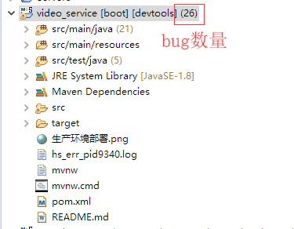
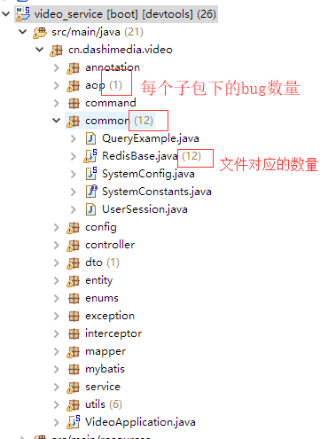
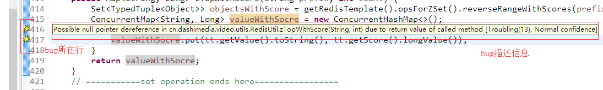
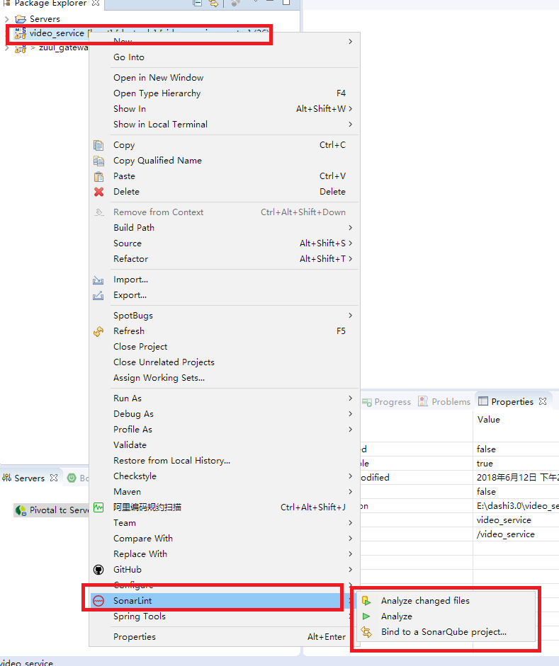
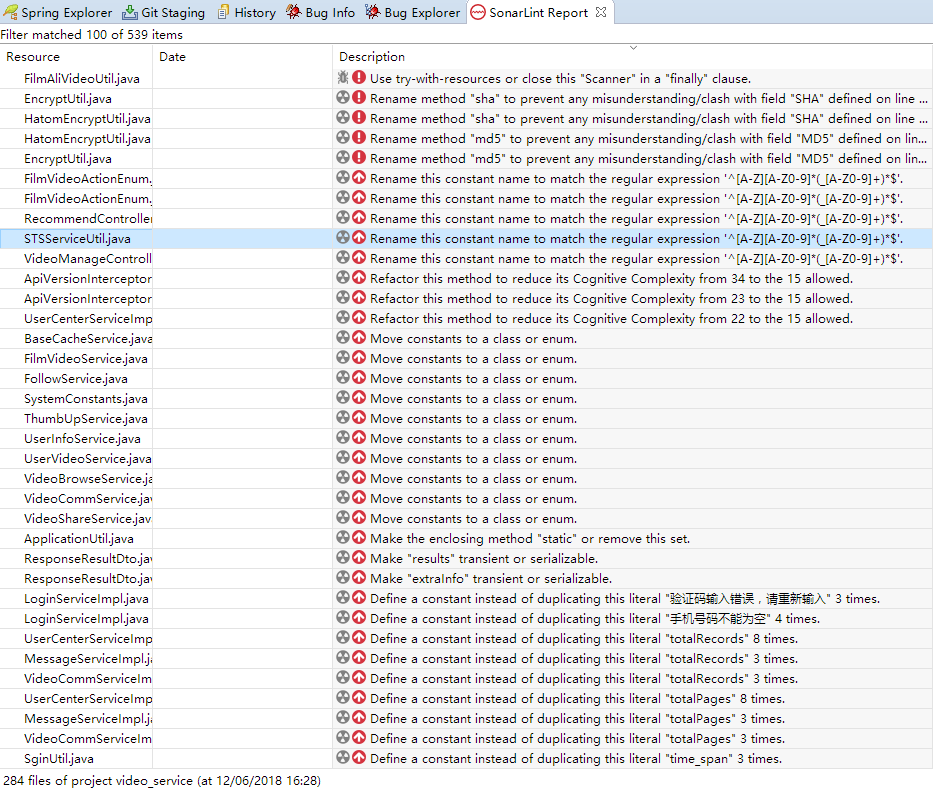
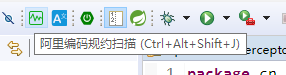
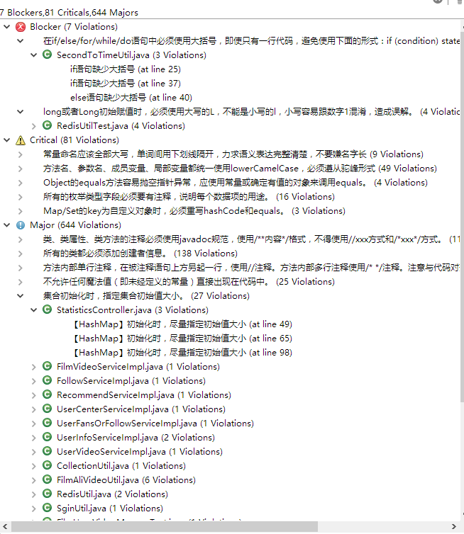

#### 安装
- 推荐 Eclipse插件: http://spotbugs.readthedocs.io/en/latest/eclipse.html#installation
- 运行：
    项目 --> 右键 --> SpotBugs --> Find Bugs
    
    
    
    
    
    
    

- Sonar: Eclipse Marketing
    
    
    
- 阿里code check    
    
    